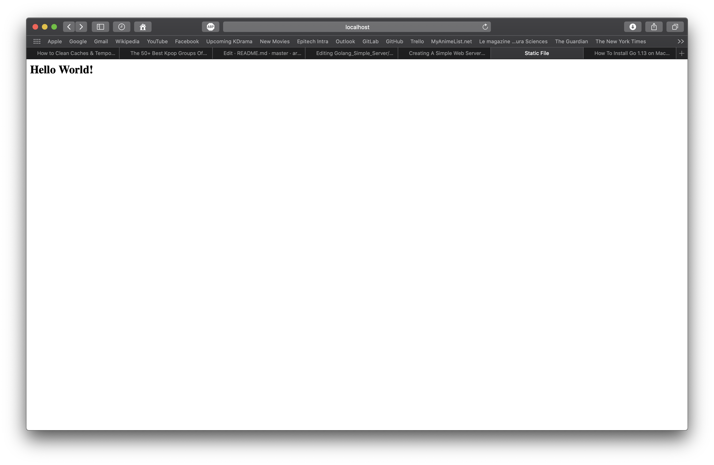

# Golang_Simple_Server
Mini project written in Go consisting of a Golang basic server which can respond to clients URL requests and send back informations as datas, files and html rendering.
The server is split into small servers units holding their own functionalities. It is using "net/http" package and can be fully secured with the help of HTTPS/HTTP over TLS.

### Requirements

| Technology    | Version |
|:------- | -------:|
| Go | 1.11+ |

Here you can find the link to download Golang according to your operating system : https://golang.org/dl/

You might also need to modify your environment variable (Linux/MacOs only) : 

`export GOROOT=/usr/local/go`

`export GOPATH=$HOME/Projects/Proj1` (Proj1 correspond to your working directory).

`export PATH=$GOPATH/bin:$GOROOT/bin:$PATH`

To check the installed Go version :

`go version`

## Run files

* To run the different servers : `go run "name_of_the_file".go`

* Navigate on you're browser to : `http://localhost:8083

## Server Data

The purpose of this Server (server_data.go) is to read the URL query/request of the user and return the requested URL according to the local path pattern.
The server also increment a counter every time the "/increment" URL is hit. Due to the fact that the web server is asynchronous, it uses mutex around the counter in order to prevent race-condition bugs.

* Exemple 1 : `http://localhost:8083/world`

* Exemple 2 : `http://localhost:8083/increment`

* Exemple 3 : `http://localhost:8083/hi`

## Server static files

The purpose of this Server (server_static_file.go) is to read the URL query/requested HTML path file and return the HTML file rendered in the browser.
The files are avaible directly where the server is launched.

* Exemple 1 : `http://localhost:8083/files_samples/page.html`

* Exemple 2 : `http://localhost:8083/files_samples/cube_sydney.cpp`

* Exemple 3 : `http://localhost:8083/files_samples/`

* Exemple 4 : `http://localhost:8083`

## Server static directory

The purpose of this Server (server_static_directory.go) is basically the same as the static files server exept that the root path can be set in any subdirectory. In this case our server is rooted to the "static" folder.

* Exemple 1 : `http://localhost:8083`

* Exemple 2 : `http://localhost:8083/index_directory.html`

* Exemple 3 : `http://localhost:8083/personal`

* Exemple 4 : `http://localhost:8083/unapp`

## Server static files/directory over HTTPS

Same as the static file/directory servers adding a layer of security with the help of HTTP over TLS/HTTPS using server.crt + server.key certificate files.

* Commands to generate self-signed certs local files using openssl :

`openssl genrsa -out server.key 2048`

`openssl ecparam -genkey -name secp384r1 -out server.key`

`openssl req -new -x509 -sha256 -key server.key -out server.crt -days 3650` (private infos)

* Exemple : `https://localhost:8083`

## Credit

Full tutorial can be found here : https://tutorialedge.net/golang/creating-simple-web-server-with-golang/

